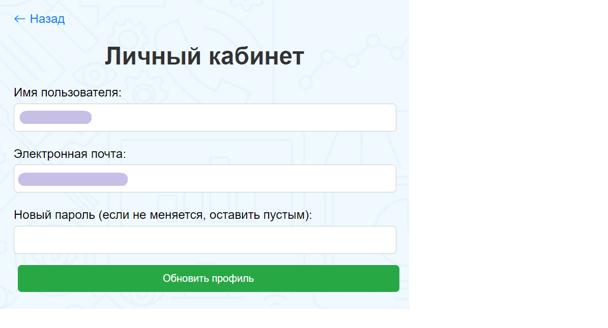

# Flask Project

## Обзор проекта

Проект представляет собой веб-приложение для онлайн-магазина, где пользователи могут регистрироваться, входить в
систему, просматривать и добавлять товары в корзину. Интерфейс создан с использованием HTML-шаблонов и CSS для
стилизации страниц.

## Основные возможности

- Регистрация и авторизация пользователей.
- Просмотр и управление профилем пользователя.
- Просмотр товаров и добавление их в корзину.
- Оформление заказа.
- Форма обратной связи для связи с поддержкой.

## Установка и запуск

1. Клонируйте репозиторий:
   ```bash
   git clone https://github.com/username/flask_project.git
   ```

2. Установите зависимости:
   ```bash
   pip install -r requirements.txt
   ```

3. Запустите приложение:
   ```bash
   python app.py
   ```

4. Откройте в браузере:
   ```
   http://127.0.0.1:5000
   ```

## Использование

### 1. Главная страница

На главной странице отображаются доступные товары для покупки. Пользователь может выбрать товар для просмотра или
добавить его в корзину.


### 2. Навиагционная панель

Сделана для удобного перехода на нажную страницу.


### 3. Регистрация и вход

- **Регистрация**: Форма для создания нового аккаунта.  
  

- **Вход**: Форма для авторизации пользователя.  
  

### 4. Просмотр товара

Пользователь может ознакомиться с подробной информацией о выбранном товаре,нажав на его фотографию.  


### 5. Работа с корзиной

Интерфейс для добавления товаров в корзину, изменения количества или удаления.  


### 6. Оформление заказа

Форма для указания адреса доставки и выбора способа оплаты.  


### 7. Подтверждение заказа

После успешного оформления заказа пользователь получает сообщение о подтверждении.  


### 8. Личный кабинет

Пользователь может изменить свои данные, включая имя и пароль, в личном кабинете.  



